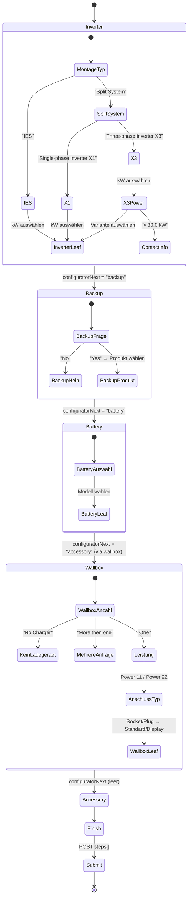

# State Machine

## Phasen-Übergangs-Diagramm



## Phase-Details

### Phase: Inverter
- **Eingehende Parameter:** lang, keine
- **Frage (titlesByPath[""]):** "Montagetyp"
- **Ausgangszustände:**
  - IES → 8 Leistungsvarianten (direkte Produkte)
  - Split System X1 → 7 Leistungsvarianten
  - Split System X3 → 9 Leistungsstufen × 2 Varianten = 18 Produkte + 1 Contact-Node
- **Validierung:** Muss genau einen Produkt-Leaf auswählen (außer > 30 kW → Contact)

### Phase: Backup
- **Eingehende Parameter:** Gewählter Inverter-Typ impliziert Kompatibilität (aber nicht validiert im Backend)
- **Frage:** "Benötigen Sie eine Ersatzstromversorgung mit automatischer Umschaltung?"
- **Ausgangszustände:**
  - Nein → kein Produkt, weiter zu Battery
  - Ja → 6 Backup-Produkte (Matebox, EPS Box-Varianten)
- **Validierung:** immer genau eine Auswahl

### Phase: Battery
- **Eingabe:** beliebig
- **Frage:** "1) Select Battery" (EN-Fallback, DE leer)
- **Ausgangszustände:** 3 Triple Power Modelle (flat, kein Produkt-Detail)
- **Offene Frage:** Keine Stock-Info — wie wird "nicht verfügbar" kommuniziert?

### Phase: Wallbox
- **Frage (implizit):** Anzahl Wallboxen
- **Ausgangszustände:**
  - No Charger → kein Produkt, weiter
  - More then one → Contact (kein Produkt)
  - One → HAC 11kW/22kW × Socket/Plug × Standard/Display = 8 Produkte
- **Validierung:** immer eine Auswahl

### Phase: Accessory / Finish
- **Status:** Serverseitig nicht implementiert ("Konfigurační data neexistují")
- **Im Rebuild:** als Platzhalter "folgt" implementieren

## Submit-Payload (rekonstruiert)
```json
{
  "steps": ["IES", "8.0 kW"],
  "lang": "de"
}
```
oder für Wallbox-Pfad:
```json
{
  "steps": ["Split System", "Three-phase inverter X3", "10.0 kW", "G-21d-4P10", "Yes", "X3 Matebox Advanced", "Triple Power T58", "One", "Power 22", "Plug", "With display"],
  "lang": "de"
}
```
